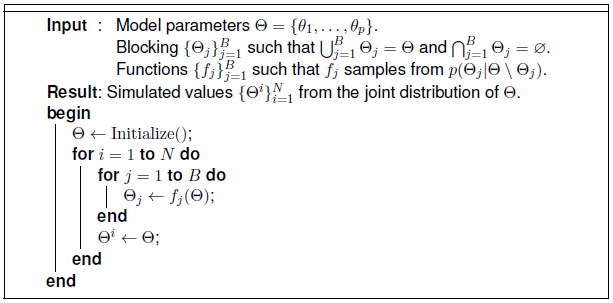

Introduction
============

MCMC Software
-------------

Markov chain Monte Carlo (MCMC) methods are a class of algorithms for simulating autocorrelated draws from probability distributions :cite:`brooks:2011:HMC,gamerman:1997:MCM,gilks:1996:MCP,robert:2004:MCS`.  They are widely used to obtain empirical estimates for and make inference on multidimensional distributions that often arise in Bayesian statistical modelling, computational physics, and computational biology.  Because MCMC provides estimates of *distributions* of interest, and is not limited to *point* estimates and asymptotic standard errors, it facilitates wide ranges of inferences and provides for more realistic prediction errors.  An MCMC algorithm can be devised for any probability model.  Implementations of algorithms are computational in nature, with the resources needed to execute algorithms directly related to the dimensionality of their associated problems.  Rapid increases in computing power and emergence of MCMC software have enabled models of increasing complexity to be fit.  For all its advantages, MCMC is regarded as one of the most important developments and powerful tools in modern statistical computing.

Several software programs provide Bayesian modelling via MCMC.  Programs range from those designed for general model fitting to those for specific models.  *WinBUGS*, its open-source incarnation *OpenBUGS*, and the 'BUGS' clone Just Another Gibbs Sampler (*JAGS*) are among the most widely used programs for general model fitting :cite:`lunn:2009:BUGS,plummer:2003:JAGS`.  These three provide similar programming syntaxes with which users can specify statistical models by simply stating relationships between data, parameters, and statistical distributions.  Once a model is specified, the programs automatically formulate an MCMC sampling scheme to simulate parameter values from their posterior distribution.  All aforementioned tasks can be accomplished with minimal programming and without specific knowledge of MCMC methodology.  Users who are adept at both and so inclined can write software modules to add new distributions and samplers to *OpenBUGS* and *JAGS* :cite:`thomas:2014:ODM,wabersich:2013:EJT`.  *Stan* is a newer and similar-in-scope program worth noting for its accessible syntax and automatically tuned Hamiltonian Monte Carlo sampling scheme :cite:`stan-software:2014`.  *PyMC* is a Python-based program that allows all modelling tasks to be accomplished in its native language, and gives users more hands-on access to model and sampling scheme specifications :cite:`patil:2010:BSM`.  Programs like *GRIMS* :cite:`neal:2012:grims` and *LaplacesDemon* :cite:`statisticat:2014:LD` represent another class of programs that fit general models.  In their approaches, users work with the functional forms of (unnormalized) probability densities directly, rather a domain specific modelling language (DSL), for model specification.  Examples of programs for specific models can be found in the **R** catalogue of packages.  For instance, the *arm* package provides Bayesian inference for generalized linear, ordered logistic or probit, and mixed-effects regression models :cite:`gelman:2014:arm`, *MCMCpack* fits a wide range of models commonly encountered in the social and behavioral sciences :cite:`martin:2013:MCP`, and many others that are more focused on specific classes of models can be found in the "Bayesian Inference" task view on the Comprehensive **R** Archive Network :cite:`park:2014:cran`.

The Mamba Package
-----------------

*Mamba* :cite:`smith:2014:MCMC` is a **julia** :cite:`julia:2014` package designed for general Bayesian model fitting via MCMC.  Like *OpenBUGS* and *JAGS*, it supports a wide range of model and distributional specifications, and provides a syntax for model specification.  Unlike those two, and like *PyMC*, *Mamba* provides a unified environment in which all interactions with the software are made through a single, interpreted language.  Any **julia** operator, function, type, or package can be used for model specification; and custom distributions and samplers can be written in **julia** to extend the package.  Conversely, interactions with and extensions to *OpenBUGS* and *JAGS* can involve three different programming environments --- **R** wrappers used to call the programs, their DSLs, and the underlying implementations in Component Pascal and C++.  Advantages of a unified environment include more flexible model specification; tighter integration with supplied functions for convergence diagnostics and posterior inference; and faster development, testing, and debugging of extensions.  Advantages of the `BUGS` DSLs include more concise model specification and facilitation of automated sampling scheme formulation.  Indeed, sampling schemes must be selected manually in the initial release of *Mamba*.  Nevertheless, *Mamba* holds other distinct advantages over existing offerings.  In particular, it provides arbitrary blocking of model parameters and designation of block-specific samplers; samplers that can be used with the included simulation engine or apart from it; and command-line access to all package functionality, including its simulation API.  Likewise, advantages of the **julia** language include its familiar syntax, focus on technical computing, and benchmarks showing it to be one or more orders of magnitude faster than **R** and **Python** :cite:`bezanson:2012:JFD`.  Finally, the intended audience for *Mamba* includes individuals interested in programming in **julia**; who wish to have low-level access to model design and implementation; and, in some cases, are able to derive full conditional distributions of model parameters (up to normalizing constants).

*Mamba* allows for the implementation of an MCMC sampling scheme to simulate draws for a set of Bayesian model parameters :math:`(\theta_1, \ldots, \theta_p)` from their joint posterior distribution.  The package supports the general Gibbs :cite:`gelfand:1990:SBA,geman:1984:SRG` scheme outlined in the algorithm below.  In its implementation with the package, the user may specify any blocking :math:`\{\Theta_j\}_{j=1}^{B}` of the parameters and corresponding functions :math:`\{f_j\}_{j=1}^{B}` to sample each :math:`\Theta_j` from its full conditional distribution :math:`p(\Theta_j | \Theta \setminus \Theta_{j})`.  Simulation performance (efficiency and runtime) can be affected greatly by the choice of blocking scheme and sampling functions.  For some models, an optimal choice may not be obvious, and different choices may need to be tried to find one that gives a desired level of performance.  This can be a time-consuming process.  The *Mamba* package provides a set of **julia** types and method functions to facilitate the specification of different schemes and functions.  Supported sampling functions include those provided by the package, user-defined functions, and functions from other packages; thus providing great flexibility with respect to sampling methods.  Furthermore, a sampling engine is provided to save the user from having to implement tasks common to all MCMC simulators.  Therefore, time and energy can be focused on implementation aspects that most directly affect performance.

.. _figure-Gibbs:

	*Mamba* Gibbs sampling scheme
	
A summary of the steps involved in using the package to perform MCMC simulation for a Bayesian model is given below.

	#. Decide on names to use for **julia** objects that will represent the model data structures and parameters (:math:`\theta_1, \ldots, \theta_p`).  For instance, the :ref:`section-Line` section describes a linear regression example in which predictor :math:`\bm{x}` and response :math:`\bm{y}` are represented by objects ``x`` and ``y``, and regression parameters :math:`\beta_0`, :math:`\beta_1`, and :math:`\sigma^2` by objects ``b0``, ``b1``, and ``s2``.

	#. Create a dictionary to store all structures considered to be fixed in the simulation; e.g., the ``line`` dictionary in the regression example.

	#. Specify the model using the constructors described in the :ref:`section-MCMC-Types` section, to create the following:
 
		a. An ``MCMCStochastic`` object for each model term that has a distributional specification.  This includes parameters and data, such as the regression parameters ``b0``, ``b1``, and ``s2`` that have prior distributions and ``y`` that has a likelihood specification.

		b. A vector of ``MCMCSampler`` objects containing supplied, user-defined, or external functions :math:`\{f_j\}_{j=1}^{B}` for sampling each parameter block :math:`\Theta_j`.

		c. An ``Model`` object from the resulting stochastic nodes and sampler vector.

	#. Simulate parameter values with the :func:`mcmc` function.
	
	#. Use the MCMC output to check convergence and perform posterior inference.
