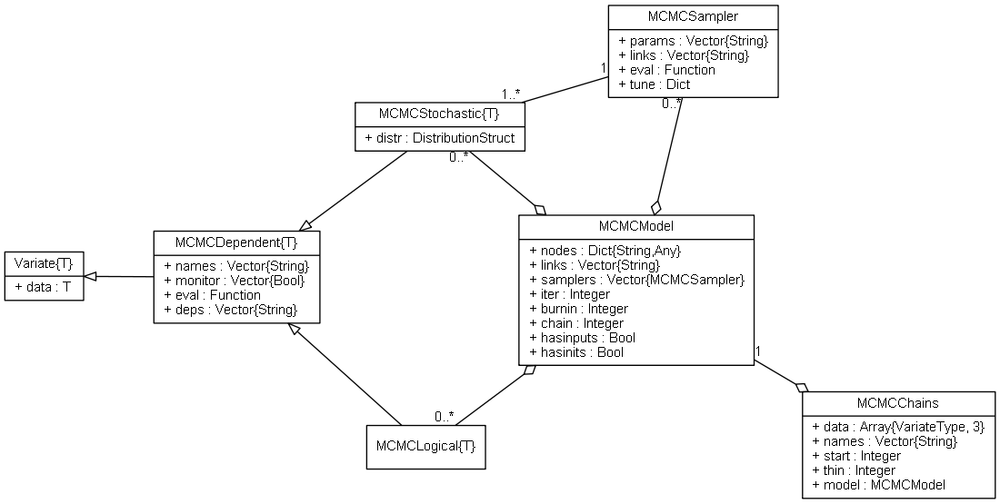

.. _section-MCMC-Types:

MCMC Types
==========

The *MCMC* types and their relationships are depicted below with a Unified Modelling Language (UML) diagram.  In the diagram, types are represented with boxes that display their respective names in the top-most panels, and fields in the second panels.  By convention, plus signs denote fields that are publicly accessible, which is always the case for these structures in **julia**.  Hollow triangle arrows point to types that the originator extends.  Solid diamond arrows indicate that a number of instances of the type being pointed to are contained in the originator.  The undirected line between ``Sampler`` and ``Stochastic`` represents a bi-directional association.  Numbers on the graph indicate that there is one (1), zero or more (0..*), or one or more (1..*) instances of a type at the corresponding end of a relationship.

    UML relational diagram of *MCMC* types and their fields.

The relationships are as follows.  Type ``Model`` contains a dictionary field (``Dict{Symbol,Any}``) of model nodes and a field (``Vector{Sampler}``) of one or more sampling functions.  Nodes can be one of three types:

    .. index:: Nodes; Stochastic
    .. index:: Nodes; Logical
    .. index:: Nodes; Input

    * **Stochastic nodes** (``Stochastic``) are any model terms that have likelihood or prior distributional specifications.
    * **Logical nodes** (``Logical``) are terms that are deterministic functions of other nodes.
    * **Input nodes** (not shown) are any other model terms and data types that are considered to be fixed quantities in the analysis.

``Stochastic`` and ``Logical`` are inherited from the base :ref:`section-Variate` type and can be used with operators and in functions defined for that type.  The sampling functions in ``Model`` each correspond to a block of one or more model parameters (stochastic nodes) to be sampled from a target distribution (e.g. full conditional) during the simulation.  Finally, ``Chains`` stores simulation output for a given model.  Detailed information about each type is provided in the subsequent sections.

.. toctree::
    :maxdepth: 1

    mcmc/dependent.rst
    mcmc/distributions.rst
    mcmc/sampler.rst
    mcmc/model.rst
    mcmc/chains.rst
