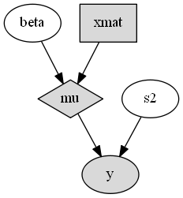

.. index::
    single: Examples; Linear Regression

.. _section-Line:

Tutorial
========

The complete source code for the examples contained in this tutorial can be obtained :download:`here <tutorial/line.jl>`.

.. _section-Line-Model:

Bayesian Linear Regression Model
--------------------------------

In the sections that follow, the Bayesian simple linear regression example from the `BUGS 0.5` manual :cite:`spiegelhalter:1996:BIU` is used to illustrate features of the package.  The example describes a regression relationship between observations :math:`\bm{x} = (1, 2, 3, 4, 5)^\top` and :math:`\bm{y} = (1, 3, 3, 3, 5)^\top` that can be expressed as

.. math::

    \bm{y} &\sim \text{Normal}(\bm{\mu}, \sigma^2 \bm{I}) \\
    \bm{\mu} &= \bm{X} \bm{\beta}

with prior distribution specifications

.. math::

    \bm{\beta} &\sim \text{Normal}\left(
      \bm{\mu}_\pi =
      \begin{bmatrix}
        0 \\
        0 \\
      \end{bmatrix},
      \bm{\Sigma}_\pi =
      \begin{bmatrix}
        1000 & 0 \\
        0 & 1000 \\
      \end{bmatrix}
    \right) \\
    \sigma^2 &\sim \text{InverseGamma}(\alpha_\pi = 0.001, \beta_\pi = 0.001),

where :math:`\bm{\beta} = (\beta_0, \beta_1)^\top`, and :math:`\bm{X}` is a design matrix with an intercept vector of ones in the first column and :math:`\bm{x}` in the second.  Primary interest lies in making inference about the :math:`\beta_0`, :math:`\beta_1`, and :math:`\sigma^2` parameters, based on their posterior distribution.  A computational consideration in this example is that inference cannot be obtain from the joint posterior directly because of its nonstandard form, derived below up to a constant of proportionality.

.. math::

    p(\bm{\beta}, \sigma^2 | \bm{y}) &\propto p(\bm{y} | \bm{\beta}, \sigma^2) p(\bm{\beta}) p(\sigma^2) \\
    &\propto \left(\sigma^2\right)^{-n/2} \exp\left\{-\frac{1}{2 \sigma^2} (\bm{y} - \bm{X} \bm{\beta})^\top (\bm{y} - \bm{X} \bm{\beta}) \right\} \\
    &\quad \times \exp\left\{-\frac{1}{2} (\bm{\beta} - \bm{\mu}_\pi)^\top \bm{\Sigma}_\pi^{-1} (\bm{\beta} - \bm{\mu}_\pi) \right\}
    \left(\sigma^2\right)^{-\alpha_\pi - 1} \exp\left\{-\beta_\pi / \sigma^2\right\}

A common alternative is to make approximate inference based on parameter values simulated from the posterior with MCMC methods.

.. _section-Line-Specification:

Model Specification
-------------------

Nodes
^^^^^

In the `Mamba` package, terms that appear in the Bayesian model specification are referred to as *nodes*.  Nodes are classified as one of three types:

    * **Stochastic nodes** are any model terms that have likelihood or prior distributional specifications.  In the regression example, :math:`\bm{y}`, :math:`\bm{\beta}`, and :math:`\sigma^2` are stochastic nodes.
    * **Logical nodes** are terms, like :math:`\bm{\mu}`, that are deterministic functions of other nodes.
    * **Input nodes** are any remaining model terms (:math:`\bm{X}`) and are considered to be fixed quantities in the analysis.

Note that the :math:`\bm{y}` node has both a distributional specification and is a fixed quantity.  It is designated a stochastic node in `Mamba` because of its distributional specification.  This allows for the possibility of model terms with distributional specifications that are a mix of observed and unobserved elements, as in the case of missing values in response vectors.

Model implementation begins by instantiating stochastic and logical nodes using the `Mamba`--supplied constructors ``Stochastic`` and ``Logical``.  Stochastic and logical nodes for a model are defined with a call to the ``Model`` constructor.  The model constructor formally defines and assigns names to the nodes.  User-specified names are given on the left-hand sides of the arguments to which ``Logical`` and ``Stochastic`` nodes are passed.

.. code-block:: julia

    using Mamba

    ## Model Specification

    model = Model(

      y = Stochastic(1,
        (mu, s2) ->  MvNormal(mu, sqrt(s2)),
        false
      ),

      mu = Logical(1,
        (xmat, beta) -> xmat * beta,
        false
      ),

      beta = Stochastic(1,
        () -> MvNormal(2, sqrt(1000))
      ),

      s2 = Stochastic(
        () -> InverseGamma(0.001, 0.001)
      )

    )

A single integer value for the first ``Stochastic`` constructor argument indicates that the node is an array of the specified dimension.  Absence of an integer value implies a scalar node.  The next argument is a `function <http://docs.julialang.org/en/latest/manual/functions/>`_ that may contain any valid **julia** code.  Functions should be defined to take, as their arguments, the inputs upon which their nodes depend and, for stochastic nodes, return distribution objects or arrays of objects compatible with the `Distributions` package :cite:`bates:2014:DP`.  Such objects represent the nodes' distributional specifications.  An optional boolean argument after the function can be specified to indicate whether values of the node should be monitored (saved) during MCMC simulations (default: ``true``).

Stochastic functions must return a single distribution object that can accommodate the dimensionality of the node, or return an array of (univariate or multivariate) distribution objects of the same dimension as the node.  Examples of alternative, but equivalent, prior distributional specifications for the ``beta`` node are shown below.

.. code-block:: julia

    # Case 1: Multivariate Normal with independence covariance matrix
    beta = Stochastic(1,
      () -> MvNormal(2, sqrt(1000))
    )

    # Case 2: One common univariate Normal
    beta = Stochastic(1,
      () -> Normal(0, sqrt(1000))
    )

    # Case 3: Array of univariate Normals
    beta = Stochastic(1,
      () -> UnivariateDistribution[Normal(0, sqrt(1000)), Normal(0, sqrt(1000))]
    )

    # Case 4: Array of univariate Normals
    beta = Stochastic(1,
      () -> UnivariateDistribution[Normal(0, sqrt(1000)) for i in 1:2]
    )

Case 1 is one of the `multivariate normal distributions <http://distributionsjl.readthedocs.org/en/latest/multivariate.html#multivariate-normal-distribution>`_ available in the `Distributions` package, and the specification used in the example model implementation.  In Case 2, a single `univariate normal distribution <http://distributionsjl.readthedocs.org/en/latest/univariate.html#normal>`_ is specified to imply independent priors of the same type for all elements of ``beta``.  Cases 3 and 4 explicitly specify a univariate prior for each element of ``beta`` and allow for the possibility of differences among the priors.  Both return `arrays <http://docs.julialang.org/en/latest/manual/arrays/>`_ of Distribution objects, with the last case automating the specification of array elements.

In summary, ``y`` and ``beta`` are stochastic vectors, ``s2`` is a stochastic scalar, and ``mu`` is a logical vector.  We note that the model could have been implemented without ``mu``.  It is included here primarily to illustrate use of a logical node.  Finally, note that nodes ``y`` and ``mu`` are not being monitored.

.. _section-Line-Schemes:

Sampling Schemes
^^^^^^^^^^^^^^^^

The package provides a flexible system for the specification of schemes to sample stochastic nodes.  Arbitrary blocking of nodes and designation of block-specific samplers is supported.  Furthermore, block-updating of nodes can be performed with samplers provided, defined by the user, or available from other packages.  Schemes are specified as vectors of ``Sampler`` objects.  Constructors are provided for several popular sampling algorithms, including adaptive Metropolis, No-U-Turn (NUTS), and slice sampling.  Example schemes are shown below.  In the first one, NUTS is used for the sampling of ``beta`` and slice for ``s2``.  The two nodes are block together in the second scheme and sampled jointly with NUTS.

.. code-block:: julia

    ## Hybrid No-U-Turn and Slice Sampling Scheme
    scheme1 = [NUTS([:beta]),
               Slice([:s2], [3.0])]

    ## No-U-Turn Sampling Scheme
    scheme2 = [NUTS([:beta, :s2])]

Additionally, users are free to create their own samplers with the generic ``Sampler`` constructor.  This is particularly useful in settings were full conditional distributions are of standard forms for some nodes and can be sampled from directly.  Such is the case for the full conditional of :math:`\bm{\beta}` which can be written as

.. math::

    p(\bm{\beta} | \sigma^2, \bm{y}) &\propto p(\bm{y} | \bm{\beta}, \sigma^2) p(\bm{\beta}) \\
    &\propto \exp\left\{-\frac{1}{2} (\bm{\beta} - \bm{\mu})^\top \bm{\Sigma}^{-1} (\bm{\beta} - \bm{\mu})\right\},

where :math:`\bm{\Sigma} = \left(\frac{1}{\sigma^2} \bm{X}^\top \bm{X} + \bm{\Sigma}_\pi^{-1}\right)^{-1}` and :math:`\bm{\mu} = \bm{\Sigma} \left(\frac{1}{\sigma^2} \bm{X}^\top \bm{y} + \bm{\Sigma}_\pi^{-1} \bm{\mu}_\pi\right)`, and is recognizable as multivariate normal.  Likewise,

.. math::

    p(\sigma^2 | \bm{\beta}, \mathbf{y}) &\propto p(\bm{y} | \bm{\beta}, \sigma^2) p(\sigma^2) \\
    &\propto \left(\sigma^2\right)^{-(n/2 + \alpha_\pi) - 1} \exp\left\{-\frac{1}{\sigma^2} \left(\frac{1}{2} (\bm{y} - \bm{X} \bm{\beta})^\top (\bm{y} - \bm{X} \bm{\beta}) + \beta_\pi \right) \right\},

whose form is inverse gamma with :math:`n / 2 + \alpha_\pi` shape and :math:`(\bm{y} - \bm{X} \bm{\beta})^\top (\bm{y} - \bm{X} \bm{\beta}) / 2 + \beta_\pi` scale parameters.  A user-defined sampling scheme to generate draws from these full conditionals is constructed below.

.. code-block:: julia

    ## User-Defined Samplers

    Gibbs_beta = Sampler([:beta],
      (beta, s2, xmat, y) ->
        begin
          beta_mean = mean(beta.distr)
          beta_invcov = invcov(beta.distr)
          Sigma = inv(xmat' * xmat / s2 + beta_invcov)
          mu = Sigma * (xmat' * y / s2 + beta_invcov * beta_mean)
          rand(MvNormal(mu, Sigma))
        end
    )

    Gibbs_s2 = Sampler([:s2],
      (mu, s2, y) ->
        begin
          a = length(y) / 2.0 + shape(s2.distr)
          b = sumabs2(y - mu) / 2.0 + scale(s2.distr)
          rand(InverseGamma(a, b))
        end
    )

    ## User-Defined Sampling Scheme
    scheme3 = [Gibbs_beta, Gibbs_s2]

In these samplers, the respective ``MvNormal(2, sqrt(1000))`` and ``InverseGamma(0.001, 0.001)`` priors on stochastic nodes ``beta`` and ``s2`` are accessed directly through the ``distr`` :ref:`fields <section-Stochastic>`.  Features of the `Distributions` objects returned by ``beta.distr`` and ``s2.distr`` can, in turn, be extracted with method functions defined in that package or through their own fields.  For instance, ``mean(beta.distr)`` and ``invcov(beta.distr)`` apply method functions to extract the mean vector and inverse-covariance matrix of the ``beta`` prior.  Whereas, ``shape(s2.distr)`` and ``scale(s2.distr)`` extract the shape and scale parameters from fields of the inverse-gamma prior.  `Distributions` method functions can be found in that package's `documentation <http://distributionsjl.readthedocs.org>`_; whereas, fields are found in the `source code <https://github.com/JuliaStats/Distributions.jl>`_.

When possible to do so, direct sampling from full conditions is often preferred in practice because it tends to be more efficient than general-purpose algorithms.  Schemes that mix the two approaches can be used if full conditionals are available for some model parameters but not for others.  Once a sampling scheme is formulated in `Mamba`, it can be assigned to an existing model with a call to the ``setsamplers!`` function.

.. code-block:: julia

    ## Sampling Scheme Assignment
    setsamplers!(model, scheme1)

Alternatively, a predefined scheme can be passed in to the ``Model`` constructor at the time of model implementation as the value to its ``samplers`` argument.

.. _section-Model-Expression:

Model Expression Syntax
^^^^^^^^^^^^^^^^^^^^^^^

All nodes in an implemented model are stored in a `Mamba` ``Model`` structure, from which they can be accessed with the symbol representations of their names (keys).  For instance, in the regression example, ``:y``, ``:beta``, ``:s2``, ``:mu``, and ``:xmat`` are the symbol representations of the stochastic, logical, and input nodes described previously.  The ``Model`` structure can be referenced directly by the name ``model`` if expression syntax, instead of the previously presented function syntax, is used for the specification of nodes, as shown below.  Model expression syntax is a legacy feature of the package that is being phased out in favor of the recommended function syntax.

.. code-block:: julia

    model = Model(

      y = Stochastic(1,
        quote
          mu = model[:mu]
          s2 = model[:s2]
          MvNormal(mu, sqrt(s2))
        end,
        false
      ),

      mu = Logical(1,
        :(model[:xmat] * model[:beta]),
        false
      ),

      beta = Stochastic(1,
        :(MvNormal(2, sqrt(1000)))
      ),

      s2 = Stochastic(
        :(InverseGamma(0.001, 0.001))
      )

    )

    Gibbs_beta = Sampler([:beta],
      quote
        beta = model[:beta]
        s2 = model[:s2]
        xmat = model[:xmat]
        y = model[:y]
        beta_mean = mean(beta.distr)
        beta_invcov = invcov(beta.distr)
        Sigma = inv(xmat' * xmat / s2 + beta_invcov)
        mu = Sigma * (xmat' * y / s2 + beta_invcov * beta_mean)
        rand(MvNormal(mu, Sigma))
      end
    )

    Gibbs_s2 = Sampler([:s2],
      quote
        mu = model[:mu]
        s2 = model[:s2]
        y = model[:y]
        a = length(y) / 2.0 + shape(s2.distr)
        b = sumabs2(y - mu) / 2.0 + scale(s2.distr)
        rand(InverseGamma(a, b))
      end
    )

An auxiliary macro is provided to simplify the syntax for expression-based node specification.

.. function:: @modelexpr(args...)

    A `macro <http://julia.readthedocs.org/en/latest/manual/metaprogramming/#macros>`_ to automate the declaration of ``model`` variables in expression supplied to ``MCMCStocastic``, ``Logical``, and ``Sampler`` constructors.

    **Arguments**

        * ``args...`` : sequence of one or more arguments, such that the last argument is a single expression or code block, and the previous ones are variable names of model nodes upon which the expression depends.

    **Value**

        An expression block of nodal variable declarations followed by the specified expression.

    **Example**

        Calls to ``@modelexpr`` can be used to shorten the expressions specified in the previous ``Model`` specification and calls to ``Sampler``, as shown below.  In essence, this macro call automates the tasks of declaring variables ``beta``, ``s2``, ``xmat``, and ``y``; and returns the same quoted expressions as before but with less coding required.

        .. code-block:: julia

            model = Model(

              y = Stochastic(1,
                @modelexpr(mu, s2,
                  MvNormal(mu, sqrt(s2))
                ),
                false
              ),

              mu = Logical(1,
                @modelexpr(xmat, beta,
                  xmat * beta
                ),
                false
              ),

              beta = Stochastic(1,
                :(MvNormal(2, sqrt(1000)))
              ),

              s2 = Stochastic(
                :(InverseGamma(0.001, 0.001))
              )

            )

            Gibbs_beta = Sampler([:beta],
              @modelexpr(beta, s2, xmat, y,
                begin
                  beta_mean = mean(beta.distr)
                  beta_invcov = invcov(beta.distr)
                  Sigma = inv(xmat' * xmat / s2 + beta_invcov)
                  mu = Sigma * (xmat' * y / s2 + beta_invcov * beta_mean)
                  rand(MvNormal(mu, Sigma))
                end
              )
            )

            Gibbs_s2 = Sampler([:s2],
              @modelexpr(mu, s2, y,
                begin
                  a = length(y) / 2.0 + shape(s2.distr)
                  b = sumabs2(y - mu) / 2.0 + scale(s2.distr)
                  rand(InverseGamma(a, b))
                end
              )
            )

.. _section-Line-DAG:

Directed Acyclic Graphs
-----------------------

One of the internal structures created by ``Model`` is a graph representation of the model nodes and their associations.  Graphs are managed internally with the `Graphs` package :cite:`white:2014:GP`.  Like `OpenBUGS`, `JAGS`, and other `BUGS` clones, `Mamba` fits models whose nodes form a directed acyclic graph (DAG).  A *DAG* is a graph in which nodes are connected by directed edges and no node has a path that loops back to itself.  With respect to statistical models, directed edges point from parent nodes to the child nodes that depend on them.  Thus, a child node is independent of all others, given its parents.

The DAG representation of a ``Model`` can be printed out at the command-line or saved to an external file in a format that can be displayed with the `Graphviz <http://www.graphviz.org/>`_ software.

.. code-block:: julia

    ## Graph Representation of Nodes

    >>> draw(model)

    digraph MambaModel {
      "mu" [shape="diamond", fillcolor="gray85", style="filled"];
        "mu" -> "y";
      "xmat" [shape="box", fillcolor="gray85", style="filled"];
        "xmat" -> "mu";
      "beta" [shape="ellipse"];
        "beta" -> "mu";
      "s2" [shape="ellipse"];
        "s2" -> "y";
      "y" [shape="ellipse", fillcolor="gray85", style="filled"];
    }

    >>> draw(model, filename="lineDAG.dot")

Either the printed or saved output can be passed manually to the Graphviz software to plot a visual representation of the model.  If **julia** is being used with a front-end that supports in-line graphics, like `IJulia` :cite:`johnson:2015:IJ`, and the `GraphViz` **julia** package :cite:`fischer:2014:GV` is installed, then the following code will plot the graph automatically.

.. code-block:: julia

    using GraphViz

    >>> display(Graph(graph2dot(model)))

A generated plot of the regression model graph is show in the figure below.

    Directed acyclic graph representation of the example regression model nodes.

Stochastic, logical, and input nodes are represented by ellipses, diamonds, and rectangles, respectively.  Gray-colored nodes are ones designated as unmonitored in MCMC simulations.  The DAG not only allows the user to visually check that the model specification is the intended one, but is also used internally to check that nodal relationships are acyclic.

.. _section-Line-Simulation:

MCMC Simulation
---------------

Data
^^^^

For the example, observations :math:`(\bm{x}, \bm{y})` are stored in a **julia** dictionary defined in the code block below.  Included are predictor and response vectors ``:x`` and ``:y`` as well as a design matrix ``:xmat`` corresponding to the model matrix :math:`\bm{X}`.

.. code-block:: julia

    ## Data
    line = Dict{Symbol, Any}(
      :x => [1, 2, 3, 4, 5],
      :y => [1, 3, 3, 3, 5]
    )
    line[:xmat] = [ones(5) line[:x]]

Initial Values
^^^^^^^^^^^^^^

A **julia** vector of dictionaries containing initial values for all stochastic nodes must be created.  The dictionary keys should match the node names, and their values should be vectors whose elements are the same type of structures as the nodes.  Three sets of initial values for the regression example are created in with the following code.

.. code-block:: julia

    ## Initial Values
    inits = [
      Dict{Symbol, Any}(
        :y => line[:y],
        :beta => rand(Normal(0, 1), 2),
        :s2 => rand(Gamma(1, 1))
      )
    for i in 1:3
    ]

Initial values for ``y`` are those in the observed response vector.  Likewise, the node is not updated in the sampling schemes defined earlier and thus retains its initial values throughout MCMC simulations.  Initial values are generated for ``beta`` from a normal distribution and for ``s2`` from a gamma distribution.

MCMC Engine
^^^^^^^^^^^

MCMC simulation of draws from the posterior distribution of a declared set of model nodes and sampling scheme is performed with the :func:`mcmc` function.  As shown below, the first three arguments are a ``Model`` object, a dictionary of values for input nodes, and a dictionary vector of initial values.  The number of draws to generate in each simulation run is given as the fourth argument.  The remaining arguments are named such that ``burnin`` is the number of initial values to discard to allow for convergence; ``thin`` defines the interval between draws to be retained in the output; and ``chains`` specifies the number of times to run the simulator.  Results are retuned as ``Chains`` objects on which methods for posterior inference are defined.

.. code-block:: julia

    ## MCMC Simulations

    setsamplers!(model, scheme1)
    sim1 = mcmc(model, line, inits, 10000, burnin=250, thin=2, chains=3)

    setsamplers!(model, scheme2)
    sim2 = mcmc(model, line, inits, 10000, burnin=250, thin=2, chains=3)

    setsamplers!(model, scheme3)
    sim3 = mcmc(model, line, inits, 10000, burnin=250, thin=2, chains=3)

.. index:: Parallel Computing

Parallel Computing
^^^^^^^^^^^^^^^^^^

The simulation of multiple chains will be executed in parallel automatically if **julia** is running in multiprocessor mode on a multiprocessor system.  Multiprocessor mode can be started with the command line argument ``julia -p n``, where ``n`` is the number of available processors.  See the **julia** documentation on `parallel computing <http://julia.readthedocs.org/en/latest/manual/parallel-computing/>`_ for details.

.. _section-Line-Inference:

Posterior Inference
-------------------

.. _section-Line-Diagnostics:

Convergence Diagnostics
^^^^^^^^^^^^^^^^^^^^^^^

Checks of MCMC output should be performed to assess convergence of simulated draws to the posterior distribution.  Checks can be performed with a variety of methods.  The diagnostic of Gelman, Rubin, and Brooks :cite:`gelman:1992:IIS,brooks:1998:GMM` is one method for assessing convergence of posterior mean estimates.  Values of the diagnostic's *potential scale reduction factor (PSRF)* that are close to one suggest convergence.  As a rule-of-thumb, convergence is rejected if the 97.5 percentile of a PSRF is greater than 1.2.

.. code-block:: julia

    >>> gelmandiag(sim1, mpsrf=true, transform=true) |> showall

    Gelman, Rubin, and Brooks Diagnostic:
                  PSRF 97.5%
              s2 1.008 1.016
         beta[1] 1.009 1.010
         beta[2] 1.009 1.010
    Multivariate 1.006   NaN

The diagnostic of Geweke :cite:`geweke:1992:EAS` tests for non-convergence of posterior mean estimates.  It provides chain-specific test p-values.  Convergence is rejected for significant p-values, like those obtained for ``s2``.

.. code-block:: julia

    >>> gewekediag(sim1) |> showall

    Geweke Diagnostic:
    First Window Fraction = 0.1
    Second Window Fraction = 0.5

            Z-score p-value
         s2   1.710  0.0872
    beta[1]   1.237  0.2162
    beta[2]  -1.568  0.1168

            Z-score p-value
         s2  -1.428  0.1534
    beta[1]  -1.457  0.1452
    beta[2]   1.752  0.0797

            Z-score p-value
         s2   0.583  0.5596
    beta[1]   0.550  0.5824
    beta[2]  -0.440  0.6597

The diagnostic of Heidelberger and Welch :cite:`heidelberger:1983:SRL` tests for non-convergence (non-stationarity) and whether ratios of estimation interval halfwidths to means are within a target ratio.  Stationarity is rejected (0) for significant test p-values.  Halfwidth tests are rejected (0) if observed ratios are greater than the target, as is the case for ``s2`` and ``beta[1]``.

.. code-block:: julia

    >>> heideldiag(sim1) |> showall

    Heidelberger and Welch Diagnostic:
    Target Halfwidth Ratio = 0.1
    Alpha = 0.05

            Burn-in Stationarity p-value    Mean     Halfwidth  Test
         s2     738            1  0.0700 1.00825202 0.094300432    1
    beta[1]     251            1  0.0680 0.57366275 0.053311283    1
    beta[2]     738            1  0.0677 0.81285744 0.015404173    1

            Burn-in Stationarity p-value    Mean     Halfwidth  Test
         s2     251            1  0.4435  1.4635400 0.588158612    0
    beta[1]     251            1  0.1356  0.6293320 0.065092099    0
    beta[2]     251            1  0.0711  0.7934633 0.019215278    1

            Burn-in Stationarity p-value    Mean     Halfwidth  Test
         s2     251            1  0.6664  0.9942853 0.127959523    0
    beta[1]     251            1  0.0515  0.5883602 0.058928034    0
    beta[2]    1225            1  0.1479  0.8086080 0.018478999    1

The diagnostic of Raftery and Lewis :cite:`raftery:1992:OLR,raftery:1992:HMI` is used to determine the number of iterations required to estimate a specified quantile within a desired degree of accuracy.  For example, below are required total numbers of iterations, numbers to discard as burn-in sequences, and thinning intervals for estimating 0.025 quantiles so that their estimated cumulative probabilities are within 0.025±0.005 with probability 0.95.

.. code-block:: julia

    >>> rafterydiag(sim1) |> showall

    Raftery and Lewis Diagnostic:
    Quantile (q) = 0.025
    Accuracy (r) = 0.005
    Probability (s) = 0.95

            Thinning Burn-in    Total   Nmin Dependence Factor
         s2        2     257       8689 3746         2.3195408
    beta[1]        2     267      17897 3746         4.7776295
    beta[2]        2     267      17897 3746         4.7776295

            Thinning Burn-in    Total   Nmin Dependence Factor
         s2        2     257 8.3450x103 3746         2.2277096
    beta[1]        4     271 2.1759x104 3746         5.8085958
    beta[2]        4     275 2.8795x104 3746         7.6868660

            Thinning Burn-in    Total   Nmin Dependence Factor
         s2        2     255 7.8770x103 3746         2.1027763
    beta[1]        2     269 2.0647x104 3746         5.5117459
    beta[2]        2     263 1.4523x104 3746         3.8769354

More information on the diagnostic functions can be found in the :ref:`section-Convergence-Diagnostics` section.

.. _section-Line-Summaries:

Posterior Summaries
^^^^^^^^^^^^^^^^^^^

Once convergence has been assessed, sample statistics may be computed on the MCMC output to estimate features of the posterior distribution.  The `StatsBase` package :cite:`lin:2014:SBP` is utilized in the calculation of many posterior estimates.  Some of the available posterior summaries are illustrated in the code block below.

.. code-block:: julia

    ## Summary Statistics
    >>> describe(sim1)

    Iterations = 252:10000
    Thinning interval = 2
    Chains = 1,2,3
    Samples per chain = 4875

    Empirical Posterior Estimates:
               Mean       SD       Naive SE       MCSE       ESS
         s2 1.2203777 2.00876760 0.0166104638 0.101798287  389.3843
    beta[1] 0.5971183 1.14894446 0.0095006014 0.016925598 4607.9743
    beta[2] 0.8017036 0.34632566 0.0028637608 0.004793345 4875.0000

    Quantiles:
                2.5%       25.0%       50.0%     75.0%     97.5%
         s2  0.17091385 0.383671702 0.65371989 1.2206381 6.0313970
    beta[1] -1.74343373 0.026573102 0.59122696 1.1878720 2.8308472
    beta[2]  0.12168742 0.628297573 0.80357822 0.9719441 1.5051573

    ## Highest Posterior Density Intervals
    >>> hpd(sim1)

             95% Lower  95% Upper
         s2  0.08338409 3.8706865
    beta[1] -1.75436235 2.8109571
    beta[2]  0.09721501 1.4733163

    ## Cross-Correlations
    >>> cor(sim1)

                 s2         beta[1]      beta[2]
         s2  1.000000000  0.027467317 -0.024489462
    beta[1]  0.027467317  1.000000000 -0.905245029
    beta[2] -0.024489462 -0.905245029  1.000000000

    ## Lag-Autocorrelations
    >>> autocor(sim1)

               Lag 2       Lag 10        Lag 20       Lag 100
         s2 0.85931351   0.568056917  0.3248136852   0.024157524
    beta[1] 0.24521566  -0.021411797 -0.0077424153  -0.044989417
    beta[2] 0.20402485  -0.019107846  0.0033980453  -0.053869216

               Lag 2       Lag 10        Lag 20       Lag 100
         s2 0.92905843   0.761339226    0.58455868  0.0050215824
    beta[1] 0.28180489  -0.031007672    0.03930888  0.0394895028
    beta[2] 0.25905976  -0.017946010    0.03613043  0.0227758214

               Lag 2       Lag 10        Lag 20       Lag 100
         s2 0.68812720  0.2420402859   0.080495078 -0.0290205896
    beta[1] 0.38634357 -0.0029361782  -0.032310111  0.0028806786
    beta[2] 0.32822879 -0.0056670786  -0.020100663 -0.0062622517

    ## State Space Change Rate (per Iteration)
    >>> changerate(sim1)

                 Change Rate
              s2       1.000
         beta[1]       0.844
         beta[2]       0.844
    Multivariate       1.000

    ## Deviance Information Criterion
    >>> dic(sim1)

          DIC    Effective Parameters
    pD 13.828540            1.1661193
    pV 22.624104            5.5639015

.. _section-Line-Subsetting:

Output Subsetting
^^^^^^^^^^^^^^^^^

Additionally, sampler output can be subsetted to perform posterior inference on select iterations, parameters, and chains.

.. code-block:: julia

    ## Subset Sampler Output
    >>> sim = sim1[1000:5000, ["beta[1]", "beta[2]"], :]
    >>> describe(sim)

    Iterations = 1000:5000
    Thinning interval = 2
    Chains = 1,2,3
    Samples per chain = 2001

    Empirical Posterior Estimates:
               Mean        SD      Naive SE      MCSE       ESS
    beta[1] 0.62445845 1.0285709 0.013275474 0.023818436 1864.8416
    beta[2] 0.79392648 0.3096614 0.003996712 0.006516677 2001.0000

    Quantiles:
                2.5%       25.0%       50.0%     75.0%     97.5%
    beta[1] -1.53050898 0.076745702 0.61120944 1.2174641 2.6906753
    beta[2]  0.18846617 0.618849048 0.79323126 0.9619767 1.4502109

Restarting the Sampler
^^^^^^^^^^^^^^^^^^^^^^

Convergence diagnostics or posterior summaries may indicate that additional draws from the posterior are needed for inference.  In such cases, the :func:`mcmc` function can be used to restart the sampler with previously generated output, as illustrated below.

.. code-block:: julia

    ## Restart the Sampler
    >>> sim = mcmc(sim1, 5000)
    >>> describe(sim)

    Iterations = 252:15000
    Thinning interval = 2
    Chains = 1,2,3
    Samples per chain = 7375

    Empirical Posterior Estimates:
               Mean        SD       Naive SE       MCSE         ESS
         s2 1.54417645 3.19035983 0.0214485545 0.1773311713  323.67501
    beta[1] 0.60581307 1.31061630 0.0088111770 0.0143881097 7375.00000
    beta[2] 0.79957632 0.39219517 0.0026366993 0.0040369705 7375.00000

    Quantiles:
                2.5%        25.0%      50.0%     75.0%     97.5%
         s2  0.172611705 0.39021458 0.67594404 1.3187773 9.954807
    beta[1] -2.018556279 0.02204479 0.60063685 1.2151938 3.124831
    beta[2]  0.052432005 0.61767052 0.79997247 0.9755366 1.579400

.. _section-Line-Plotting:

Plotting
^^^^^^^^

Plotting of sampler output in `Mamba` is based on the `Gadfly` package :cite:`jones:2014:GP`.  Summary plots can be created and written to files using the ``plot`` and ``draw`` functions.

.. code-block:: julia

    ## Default summary plot (trace and density plots)
    p = plot(sim1)

    ## Write plot to file
    draw(p, filename="summaryplot.svg")

.. figure:: tutorial/summaryplot.*
    :align: center

    Trace and density plots.

The ``plot`` function can also be used to make autocorrelation and running means plots.  Legends can be added with the optional ``legend`` argument.  Arrays of plots can be created and passed to the ``draw`` function.  Use ``nrow`` and  ``ncol`` to determine how many rows and columns of plots to include in each drawing.

.. code-block:: julia

    ## Autocorrelation and running mean plots
    p = plot(sim1, [:autocor, :mean], legend=true)
    draw(p, nrow=3, ncol=2, filename="autocormeanplot.svg")

.. figure:: tutorial/autocormeanplot.*
    :align: center

    Autocorrelation and running mean plots.

.. code-block:: julia

    ## Pairwise contour plots
    p = plot(sim1, :contour)
    draw(p, nrow=2, ncol=2, filename="contourplot.svg")

.. figure:: tutorial/contourplot.*
    :align: center

    Pairwise posterior density contour plots.

.. _section-Line-Performance:

Computational Performance
-------------------------

Computing runtimes were recorded for different sampling algorithms applied to the regression example.  Runs wer performed on a desktop computer with an Intel i5-2500 CPU @ 3.30GHz.  Results are summarized in the table below.  Note that these are only intended to measure the raw computing performance of the package, and do not account for different efficiencies in output generated by the sampling algorithms.

.. table:: Number of draws per second for select sampling algorithms in `Mamba`.

    +--------------+--------------+--------+-------+--------------+--------------+
    | Adaptive Metropolis         |        |       | Slice                       |
    +--------------+--------------+--------+-------+--------------+--------------+
    | Within Gibbs | Multivariate | Gibbs  | NUTS  | Within Gibbs | Multivariate |
    +==============+==============+========+=======+==============+==============+
    | 16,700       | 11,100       | 27,300 | 2,600 | 13,600       | 17,600       |
    +--------------+--------------+--------+-------+--------------+--------------+

.. _section-Line-Development:

Development and Testing
-----------------------

Command-line access is provided for all package functionality to aid in the development and testing of models.  Examples of available functions are shown in the code block below.  Documentation for these and other related functions can be found in the :ref:`section-MCMC-Types` section.

.. code-block:: julia

    ## Development and Testing

    setinputs!(model, line)             # Set input node values
    setinits!(model, inits[1])          # Set initial values
    setsamplers!(model, scheme1)        # Set sampling scheme

    showall(model)                      # Show detailed node information

    logpdf(model, 1)                    # Log-density sum for block 1
    logpdf(model, 2)                    # Block 2
    logpdf(model)                       # All blocks

    simulate!(model, 1)                 # Simulate draws for block 1
    simulate!(model, 2)                 # Block 2
    simulate!(model)                    # All blocks

In this example, functions ``setinputs!``, ``setinits!``, and ``setsampler!`` allow the user to manually set the input node values, the initial values, and the sampling scheme form the ``model`` object, and would need to be called prior to ``logpdf`` and ``simulate!``.  Updated model objects should be returned when called; otherwise, a problem with the supplied values may exist.  Method ``showall`` prints a detailed summary of all model nodes, their values, and attributes; ``logpdf`` sums the log-densities over nodes associated with a specified sampling block (second argument); and ``simulate!`` generates an MCMC draw for the nodes.  Non-numeric results may indicate problems with distributional specifications in the second case or with sampling functions in the last case.  The block arguments are optional; and, if left unspecified, will cause the corresponding functions to be applied over all sampling blocks.  This allows testing of some or all of the samplers.
