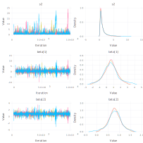
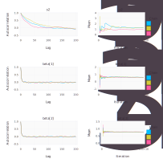

.. index::
	single: Examples; Linear Regression

.. _section-Line:

Tutorial
========

The complete source code for the examples containing in this tutorial can be obtained :download:`here <tutorial/line.jl>`.

.. _section-Line-Model:

Bayesian Linear Regression Model
--------------------------------

In the sections that follow, the Bayesian simple linear regression example from the `BUGS 0.5` manual :cite:`spiegelhalter:1996:BIU` is used to illustrate features of the package.  The example describes a regression relationship between observations :math:`\bm{x} = (1, 2, 3, 4, 5)^\top` and :math:`\bm{y} = (1, 3, 3, 3, 5)^\top` that can be expressed as

.. math::

	\bm{y} &\sim \text{Normal}(\bm{\mu}, \sigma^2 \bm{I}) \\
	\bm{\mu} &= \bm{X} \bm{\beta}

with prior distribution specifications

.. math::

    \bm{\beta} &\sim \text{Normal}\left(
      \bm{\mu}_\pi =
      \begin{bmatrix}
        0 \\
        0 \\
      \end{bmatrix},
      \bm{\Sigma}_\pi =
      \begin{bmatrix}
        1000 & 0 \\
        0 & 1000 \\
      \end{bmatrix}
    \right) \\
    \sigma^2 &\sim \text{InverseGamma}(\alpha_\pi = 0.001, \beta_\pi = 0.001),

where :math:`\bm{\beta} = (\beta_0, \beta_1)^\top`, and :math:`\bm{X}` is a design matrix with an intercept vector of ones in the first column and :math:`\bm{x}` in the second.  Primary interest lies in making inference about the :math:`\beta_0`, :math:`\beta_1`, and :math:`\sigma^2` parameters, based on their posterior distribution.  A computational consideration in this example is that inference cannot be obtain from the joint posterior directly because of its nonstandard form, derived below up to a constant of proportionality.

.. math::

  p(\bm{\beta}, \sigma^2 | \bm{y}) &\propto p(\bm{y} | \bm{\beta}, \sigma^2) p(\bm{\beta}) p(\sigma^2) \\
    &\propto \left(\sigma^2\right)^{-n/2} \exp\left\{-\frac{1}{2 \sigma^2} (\bm{y} - \bm{X} \bm{\beta})^\top (\bm{y} - \bm{X} \bm{\beta}) \right\} \\
    &\quad \times \exp\left\{-\frac{1}{2} (\bm{\beta} - \bm{\mu}_\pi)^\top \bm{\Sigma}_\pi^{-1} (\bm{\beta} - \bm{\mu}_\pi) \right\}
    \left(\sigma^2\right)^{-\alpha_\pi - 1} \exp\left\{-\beta_\pi / \sigma^2\right\}

A common alternative is to make approximate inference based on parameter values simulated from the posterior with MCMC methods.

.. _section-Line-Specification:

Model Specification
-------------------

Nodes
^^^^^

In the `MCMCsim` package, terms that appear in the Bayesian model specification are referred to as *nodes*.  Nodes are classified as one of three types:

	* **Stochastic nodes** are any model terms that have likelihood or prior distributional specifications.  In the regression example, :math:`\bm{y}`, :math:`\bm{\beta}`, and :math:`\sigma^2` are stochastic nodes.
	* **Logical nodes** are terms, like :math:`\bm{\mu}`, that are deterministic functions of other nodes.
	* **Input nodes** are any remaining model terms (:math:`\bm{X}`) and are considered to be fixed quantities in the analysis.

Note that the :math:`\bm{y}` node has both a distributional specification and is a fixed quantity.  It is designated a stochastic node in `MCMCsim` because of its distributional specification.  This allows for the possibility of model terms with distributional specifications that are a mix of observed and unobserved elements, as in the case of missing values in response vectors.

For model implementation, all nodes are stored in and accessible from a **julia** dictionary structure called ``model`` with the names (keys) of nodes being symbols.  The regression nodes will be named ``:y``, ``:beta``, ``:s2``, ``:mu``, and ``:xmat`` to correspond to the stochastic, logical, and input nodes mentioned above.  Implementation begins by instantiating the stochastic and logical nodes using the `MCMCsim`--supplied constructors ``MCMCStochastic`` and ``MCMCLogical``.  Stochastic and logical nodes for a model are defined with a call to the ``MCMCModel`` constructor.  The model constructor formally defines and assigns names to the nodes.  User-specified names are given on the left-hand sides of the arguments to which ``MCMCLogical`` and ``MCMCStochastic`` nodes are passed.

.. code-block:: julia

	using MCMCsim
	using Distributions

	## Model Specification

	model = MCMCModel(

	  y = MCMCStochastic(1,
	    quote
	      mu = model[:mu]
	      s2 = model[:s2]
	      IsoNormal(mu, sqrt(s2))
	    end,
	    false
	  ),

	  mu = MCMCLogical(1,
	    :(model[:xmat] * model[:beta]),
	    false
	  ),

	  beta = MCMCStochastic(1,
	    :(IsoNormal(2, sqrt(1000)))
	  ),

	  s2 = MCMCStochastic(
	    :(InverseGamma(0.001, 0.001))
	  )

	)
	
A single integer value for the first ``MCMCStochastic`` constructor argument indicates that the node is an array of the specified dimension.  Absence of an integer value implies a scalar node.  The next argument is a quoted `expression <http://docs.julialang.org/en/latest/manual/metaprogramming/>`_ that can contain any valid **julia** code.  Expressions for stochastic nodes must return a distribution object from or compatible with the `Distributions <http://distributionsjl.readthedocs.org/en/latest/>`_ package :cite:`juliastats:2014:DP`.  Such objects represent the nodes' distributional specifications.  An optional boolean argument after the expression can be specified to indicate whether values of the node should be monitored (saved) during MCMC simulations (default: ``true``).

Stochastic expressions must return a single distribution object that can accommodate the dimensionality of the node, or return an array of (univariate) distribution objects of the same dimension as the node.  Examples of alternative, but equivalent, prior distribution specifications for the ``beta`` node are shown below.

.. code-block:: julia

	# Case 1: Multivariate Normal with independence covariance matrix
	beta = MCMCStochastic(1,
	  :(IsoNormal(2, sqrt(1000)))
	)

	# Case 2: One common univariate Normal 
	beta = MCMCStochastic(1,
	  :(Normal(0, sqrt(1000)))
	)
  
	# Case 3: Array of univariate Normals
	beta = MCMCStochastic(1,
	  :(Distribution[Normal(0, sqrt(1000)), Normal(0, sqrt(1000))])
	)

	# Case 4: Array of univariate Normals
	beta = MCMCStochastic(1,
	  :(Distribution[Normal(0, sqrt(1000)) for i in 1:2])
	)

Case 1 is one of the `multivariate normal distributions <http://distributionsjl.readthedocs.org/en/latest/multivariate.html#multivariate-normal-distribution>`_ available in the `Distributions` package, and the specification used in the example model implementation.  In Case 2, a single `univariate normal distribution <http://distributionsjl.readthedocs.org/en/latest/univariate.html#normal>`_ is specified to imply independent priors of the same type for all elements of ``beta``.  Cases 3 and 4 explicitly specify a univariate prior for each element of ``beta`` and allow for the possibility of differences among the priors.  Both return `arrays <http://docs.julialang.org/en/latest/manual/arrays/>`_ of Distribution objects, with the last case automating the specification of array elements.

In summary, ``y`` and ``beta`` are stochastic vectors, ``s2`` is a stochastic scalar, and ``mu`` is a logical vector.  We note that the model could have been implemented without ``mu``.  It is included here primarily to illustrate use of a logical node.  Finally, note that nodes ``y`` and ``mu`` are not being monitored.
	

Sampling Schemes
^^^^^^^^^^^^^^^^

The package provides a flexible system for the specification of schemes to sample stochastic nodes.  Arbitrary blocking of nodes and designation of block-specific samplers is supported.  Furthermore, block-updating of nodes can be performed with samplers provided, defined by the user, or available from other packages.  Schemes are specified as vectors of ``MCMCSampler`` objects.  Constructors are provided for several popular sampling algorithms, including adaptive Metropolis, No-U-Turn (NUTS), and slice sampling.  Example schemes are shown below.  In the first one, NUTS is used for the sampling of ``beta`` and slice for ``s2``.  The two nodes are block together in the second scheme and sampled jointly with NUTS.

.. code-block:: julia

	## Hybrid No-U-Turn and Slice Sampling Scheme
	scheme1 = [NUTS([:beta]),
	           Slice([:s2], [1.0])]

	## No-U-Turn Sampling Scheme
	scheme2 = [NUTS([:beta, :s2])]

Additionally, users are free to create their own samplers with the generic ``MCMCSampler`` constructor.  This is particularly useful in settings were full conditional distributions are of standard forms for some nodes and can be sampled from directly.  Such is the case for the full conditional of :math:`\bm{\beta}` which can be written as

.. math::
  p(\bm{\beta} | \sigma^2, \bm{y}) &\propto p(\bm{y} | \bm{\beta}, \sigma^2) p(\bm{\beta}) \\
  &\propto \exp\left\{-\frac{1}{2} (\bm{\beta} - \bm{\mu})^\top \bm{\Sigma}^{-1} (\bm{\beta} - \bm{\mu})\right\},

where :math:`\bm{\Sigma} = \left(\frac{1}{\sigma^2} \bm{X}^\top \bm{X} + \bm{\Sigma}_\pi^{-1}\right)^{-1}` and :math:`\bm{\mu} = \bm{\Sigma} \left(\frac{1}{\sigma^2} \bm{X}^\top \bm{y} + \bm{\Sigma}_\pi^{-1} \bm{\mu}_\pi\right)`, and is recognizable as multivariate normal.  Likewise, 

.. math::

	p(\sigma^2 | \bm{\beta}, \mathbf{y}) &\propto p(\bm{y} | \bm{\beta}, \sigma^2) p(\sigma^2) \\
    &\propto \left(\sigma^2\right)^{-(n/2 + \alpha_\pi) - 1} \exp\left\{-\frac{1}{\sigma^2} \left(\frac{1}{2} (\bm{y} - \bm{X} \bm{\beta})^\top (\bm{y} - \bm{X} \bm{\beta}) + \beta_\pi \right) \right\},

whose form is inverse gamma with :math:`n / 2 + \alpha_\pi` shape and :math:`(\bm{y} - \bm{X} \bm{\beta})^\top (\bm{y} - \bm{X} \bm{\beta}) / 2 + \beta_\pi` scale parameters.  A user-defined sampling scheme to generate draws from these full conditionals is constructed below.

.. code-block:: julia

	## User-Defined Samplers

	Gibbs_beta = MCMCSampler([:beta],
	  quote
	    beta = model[:beta]
	    s2 = model[:s2]
	    xmat = model[:xmat]
	    y = model[:y]
	    beta_mean = mean(beta.distr)
	    beta_invcov = invcov(beta.distr)
	    Sigma = inv(xmat' * xmat / s2 + beta_invcov)
	    mu = Sigma * (xmat' * y / s2 + beta_invcov * beta_mean)
	    rand(MvNormal(mu, Sigma))
	  end
	)

	Gibbs_s2 = MCMCSampler([:s2],
	  quote
	    beta = model[:beta]
	    s2 = model[:s2]
	    xmat = model[:xmat]
	    y = model[:y]
	    a = length(y) / 2.0 + s2.distr.shape
	    b = sum((y - xmat * beta).^2) / 2.0 + s2.distr.scale
	    rand(InverseGamma(a, b))
	  end
	)
	
	## User-Defined Sampling Scheme
	scheme3 = [Gibbs_beta, Gibbs_s2]

When it is possible to do so, direct sampling from full conditions is often preferred in practice because it tends to be more efficient than general-purpose algorithms.  Schemes that mix the two approaches can be used if full conditionals are available for some of the parameters but not for others.

A sampling scheme can be assigned to an existing model with a call to the ``setsamplers!`` function.

.. code-block:: julia

	## Sampling Scheme Assignment
	setsamplers!(model, scheme1)

Alternatively, a predefined scheme can be passed in to the ``MCMCModel`` constructor at the time of model implementation as the value to its ``samplers`` argument.

The Model Expression Macro
^^^^^^^^^^^^^^^^^^^^^^^^^^

.. function:: @modelexpr(args...)

	A `macro <http://julia.readthedocs.org/en/latest/manual/metaprogramming/#macros>`_ to automate the declaration of ``model`` variables in expression supplied to ``MCMCStocastic``, ``MCMCLogical``, and ``MCMCSampler`` constructors. 

	**Arguments**
	
		* ``args...`` : sequence of one or more arguments, such that the last argument is a single expression or code block, and the previous ones are variable names of model nodes upon which the expression depends.
		
	**Value**
	
		An expression block of nodal variable declarations followed by the specified expression.
		
	**Example**
	
		Calls to ``@modelexpr`` can be used to shorten the expressions specified in previous calls to ``MCMCSampler``, as shown below.  In essence, this macro call automates the tasks of declaring variables ``beta``, ``s2``, ``xmat``, and ``y``; and returns the same quoted expressions as before but with less coding required.
		
		.. code-block:: julia
		
			Gibbs_beta = MCMCSampler([:beta],
			  @modelexpr(beta, s2, xmat, y,
			    begin
			      beta_mean = mean(beta.distr)
			      beta_invcov = invcov(beta.distr)
			      Sigma = inv(xmat' * xmat / s2 + beta_invcov)
			      mu = Sigma * (xmat' * y / s2 + beta_invcov * beta_mean)
			      rand(MvNormal(mu, Sigma))
			    end
			  )
			)

			Gibbs_s2 = MCMCSampler([:s2],
			  @modelexpr(beta, s2, xmat, y,
			    begin
			      a = length(y) / 2.0 + s2.distr.shape
			      b = sum((y - xmat * beta).^2) / 2.0 + s2.distr.scale
			      rand(InverseGamma(a, b))
			    end
			  )
			)
	

.. _section-Line-DAG:

Directed Acyclic Graphs
-----------------------

One of the internal structures created by ``MCMCModel`` is a graph representation of the model nodes and their associations.  Like `OpenBUGS`, `JAGS`, and other `BUGS` clones, `MCMCsim` fits models whose nodes form a directed acyclic graph (DAG).  A *DAG* is a graph in which nodes are connected by directed edges and no node has a path that loops back to itself.  With respect to statistical models, directed edges point from parent nodes to the child nodes that depend on them.  Thus, a child node is independent of all others, given its parents.

The DAG representation of an ``MCMCModel`` can be printed out at the command-line or saved to an external file in a format that can be displayed with the `Graphviz <http://www.graphviz.org/>`_ software.

.. code-block:: julia

	## Graph Representation of Nodes

	>>> print(graph2dot(model))
	
	digraph MCMCModel {
	  "beta" [shape="ellipse"];
	  	"beta" -> "mu";
	  "mu" [fillcolor="gray85", shape="diamond", style="filled"];
	  	"mu" -> "y";
	  "xmat" [fillcolor="gray85", shape="box", style="filled"];
	  	"xmat" -> "mu";
	  "s2" [shape="ellipse"];
	  	"s2" -> "y";
	  "y" [fillcolor="gray85", shape="ellipse", style="filled"];
	}
	
	>>> graph2dot(model, "lineDAG.dot")

Either the printed or saved output can be passed to Graphviz to plot a visual representation of the model.  A generated plot of the regression model graph is show in the figure below.

.. figure:: tutorial/LineDAG.png
	:align: center
	
	Directed acyclic graph representation of the example regression model nodes.

Stochastic, logical, and input nodes are represented by ellipses, diamonds, and rectangles, respectively.  Gray-colored nodes are ones designated as unmonitored in MCMC simulations.  The DAG not only allows the user to visually check that the model specification is the intended one, but is also used internally to check that nodal relationships are acyclic.

.. _section-Line-Simulation:

MCMC Simulation
---------------

Data
^^^^

For the example, observations :math:`(\bm{x}, \bm{y})` are stored in a **julia** dictionary defined in the code block below.  Included are predictor and response vectors ``:x`` and ``:y`` as well as a design matrix ``:xmat`` corresponding to the model matrix :math:`\bm{X}`.

.. code-block:: julia

	## Data
	line = (Symbol => Any)[
	  :x => [1, 2, 3, 4, 5],
	  :y => [1, 3, 3, 3, 5]
	]
	line[:xmat] = [ones(5) line[:x]]

Initial Values
^^^^^^^^^^^^^^

A **julia** vector of dictionaries containing initial values for all stochastic nodes must be created.  The dictionary keys should match the node names, and their values should be vectors whose elements are the same type of structures as the nodes.  Three sets of initial values for the regression example are created in with the following code.

.. code-block:: julia

	## Initial Values
	inits = [[:y => line[:y],
	          :beta => rand(Normal(0, 1), 2),
	          :s2 => rand(Gamma(1, 1))]
	         for i in 1:3]

Initial values for ``y`` are those in the observed response vector.  Likewise, the node is not updated in the sampling schemes defined earlier and thus retains its initial values throughout MCMC simulations.  Initial values are generated for ``beta`` from a normal distribution and for ``s2`` from a gamma distribution.

MCMC Engine
^^^^^^^^^^^

MCMC simulation of draws from the posterior distribution of a declared set of model nodes and sampling scheme is performed with the ``mcmc`` function.  As shown below, the first three arguments are an ``MCMCModel`` object, a dictionary of values for input nodes, and a dictionary vector of initial values.  The number of draws to generate in each simulation run is given as the fourth argument.  The remaining arguments are named such that ``burnin`` is the number of initial values to discard to allow for convergence; ``thin`` defines the interval between draws to be retained in the output; and ``chains`` specifies the number of times to run the simulator.

.. code-block:: julia

	## MCMC Simulations
	
	setsamplers!(model, scheme1)
	sim1 = mcmc(model, line, inits, 10000, burnin=250, thin=2, chains=3)

	setsamplers!(model, scheme2)
	sim2 = mcmc(model, line, inits, 10000, burnin=250, thin=2, chains=3)

	setsamplers!(model, scheme3)
	sim3 = mcmc(model, line, inits, 10000, burnin=250, thin=2, chains=3)

Results are retuned as ``MCMCChains`` objects on which methods for posterior inference are defined.

.. _section-Line-Inference:

Posterior Inference
-------------------

Convergence Diagnostics
^^^^^^^^^^^^^^^^^^^^^^^

Checks of MCMC output should be performed to assess convergence of simulated draws to the posterior distribution.  One popular check is the diagnostic of Brooks, Gelman, and Rubin :cite:`brooks:1998:GMM,gelman:1992:IIS`.  It is available through the ``gelmandiag`` function.

.. code-block:: julia

	## Brooks, Gelman and Rubin Convergence Diagnostic
	>>> gelmandiag(sim1, mpsrf=true, transform=true)

	5x3 Array{Any,2}:
	 ""               "PSRF"     "97.5%"
	 "beta[1]"       1.02918    1.03171 
	 "beta[2]"       1.03469    1.03662 
	 "s2"            1.03887    1.08334 
	 "Multivariate"  1.0306   NaN       

Values of the diagnostic that are greater than 1.2 are evidence of non-convergence.  The smaller diagnostic values for the regression example suggest that its draws have converged.
 

Posterior Summaries
^^^^^^^^^^^^^^^^^^^

Once convergence has been assessed, sample statistics may be computed on the MCMC output to estimate features of the posterior distribution.  Some of the available posterior summaries are illustrated in the code block below.

.. code-block:: julia

	## Summary Statistics
	>>> describe(sim1)

	Iterations = 252:10000
	Thinning interval = 2
	Number of chains = 3
	Samples per chain = 4875

	Empirical Posterior Estimates:
	4x6 Array{Any,2}:
	 ""          "Mean"    "SD"      "Naive SE"   "MCSE"         "ESS"
	 "beta[1]"  0.62304   1.36139   0.0112573    0.0190558   8639.77  
	 "beta[2]"  0.791204  0.415459  0.00343542   0.00536403  9366.67  
	 "s2"       1.67718   3.03168   0.0250689    0.13544     2706.98  

	Quantiles:
	 ""           "2.5%"     "25.0%"   "50.0%"   "75.0%"    "97.5%"
	 "beta[1]"  -2.06987    0.017145  0.601943  1.22092    3.49299 
	 "beta[2]"  -0.0672923  0.614058  0.801942  0.975351   1.59617 
	 "s2"        0.169209   0.392506  0.70132   1.42582   11.4226  

	## Highest Posterior Density Intervals
	>>> hpd(sim1)

	4x3 Array{Any,2}:
	 ""           "2.5%"     "97.5%"
	 "beta[1]"  -2.22898    3.31416 
	 "beta[2]"  -0.0470837  1.61191 
	 "s2"        0.0533557  6.93751 

	## Cross-Correlations
	>>> cor(sim1)
	
	4x4 Array{Any,2}:
	 ""           "beta[1]"    "beta[2]"    "s2"    
	 "beta[1]"   1.0         -0.903835     0.0541675
	 "beta[2]"  -0.903835     1.0         -0.0669071
	 "s2"        0.0541675   -0.0669071    1.0      

	## Lag-Autocorrelations
	>>> autocor(sim1)

	4x5x3 Array{Any,3}:
	[:, :, 1] =
	 ""          "Lag 2"    "Lag 10"   "Lag 20"   "Lag 100"
	 "beta[1]"  0.29238   -0.0702434  0.040136   0.0621334 
	 "beta[2]"  0.263146  -0.0901678  0.0505934  0.0678597 
	 "s2"       0.992458   0.970461   0.949806   0.802721  

	[:, :, 2] =
	 ""          "Lag 2"    "Lag 10"   "Lag 20"    "Lag 100"
	 "beta[1]"  0.362155  -0.0283355  0.0313453   0.0107155 
	 "beta[2]"  0.325581  -0.0165301  0.0253301  -0.00992808
	 "s2"       0.914888   0.709646   0.539679   -0.0272397 

	[:, :, 3] =
	 ""          "Lag 2"   "Lag 10"   "Lag 20"     "Lag 100"
	 "beta[1]"  0.269976  0.0140151  0.000571365  0.0181566 
	 "beta[2]"  0.218475  0.0200635  0.00861747   0.00400033
	 "s2"       0.96878   0.90511    0.859906     0.525132  

	## Deviance Information Criterion
	>>> dic(sim1)

	3x3 Array{Any,2}:
	 ""      "DIC"   "Effective Parameters"
	 "pD"  13.6836  0.477079               
	 "pV"  28.6347  7.95264                

	 
Output Subsetting
^^^^^^^^^^^^^^^^^

Additionally, sampler output can be subsetted to perform posterior inference on select iterations, parameters, and chains.

.. code-block:: julia

	## Subset Sampler Output
	>>> describe(sim1[1000:5000, ["beta[1]", "beta[2]"], :])
	
	Iterations = 1000:5000
	Thinning interval = 2
	Number of chains = 3
	Samples per chain = 2001

	Empirical Posterior Estimates:
	3x6 Array{Any,2}:
	 ""          "Mean"    "SD"      "Naive SE"   "MCSE"         "ESS"
	 "beta[1]"  0.668175  1.34189   0.0173194    0.0308641   3368.58  
	 "beta[2]"  0.779001  0.402028  0.00518886   0.00882264  3530.55  

	Quantiles:
	3x6 Array{Any,2}
	 ""           "2.5%"    "25.0%"    "50.0%"   "75.0%"   "97.5%"
	 "beta[1]"  -1.94608   0.0228286  0.601943  1.29243   3.74592 
	 "beta[2]"  -0.128758  0.598377   0.800894  0.976567  1.55979 

.. _section-Line-Plotting:

Plotting
^^^^^^^^

Summary plots can be created using the ``plot`` function and written to files using the ``draw`` function. 

.. code-block:: julia

	## Default plot is a summary plot (includes trace plots and density plots)
	p = plot(sim1)

	## Write plot to file
	draw(p, filename="summaryplot.svg")

	
	Trace and density plots.

	
The ``plot`` function can also be used to make autocorrelation and running means plots.  Legends can be added with the optional ``legend`` argument.  Arrays of plots can be created and passed to the ``draw`` function.  Use ``ncol`` and ``nrow`` to determine how many columns and rows of plots to include in each drawing.

.. code-block:: julia

	p = [plot(sim1, :autocor) plot(sim1, :mean, legend=true)].'
	draw(p, ncol=2, nrow=3, filename="autocormeanplot.svg")

	
	Autocorrelation and running mean plots.

.. _section-Line-Performance:

Computational Performance
-------------------------

Computing runtimes were recorded for different sampling algorithms applied to the regression example.  Runs wer performed on a desktop computer with an Intel i5-2500 CPU @ 3.30GHz.  Results are summarized in the table below.  Note that these are only intended to measure the raw computing performance of the package, and do not account for different efficiencies in output generated by the sampling algorithms.

.. table:: Number of draws per second for select sampling algorithms in `MCMCsim`.

	+--------------+--------------+--------+-------+--------------+--------------+
	| Adaptive Metropolis         |        |       | Slice                       |
	+--------------+--------------+        |       +--------------+--------------+
	| Within Gibbs | Multivariate | Gibbs  | NUTS  | Within Gibbs | Multivariate |
	+==============+==============+========+=======+==============+==============+
	| 16,700       | 11,100       | 27,300 | 2,600 | 13,600       | 17,600       |
	+--------------+--------------+--------+-------+--------------+--------------+

	
.. _section-Line-Development:

Development and Testing
-----------------------

Command-line access is provided for all package functionality to aid in the development and testing of models.  Examples of available functions are shown in the code block below.  Documentation for these and other related functions can be found in the :ref:`section-MCMC-Types` section. 

.. code-block:: julia

	## Development and Testing

	setinputs!(model, line)             # Set input node values
	setinits!(model, inits[1])          # Set initial values
	setsamplers!(model, scheme1)        # Set sampling scheme

	showall(model)                      # Show detailed node information

	logpdf(model, 1)                    # Log-density sum for block 1
	logpdf(model, 2)                    # Block 2
	logpdf(model)                       # All blocks

	simulate!(model, 1)                 # Simulate draws for block 1
	simulate!(model, 2)                 # Block 2
	simulate!(model)                    # All blocks

In this example, functions ``setinputs!``, ``setinits!``, and ``setsampler!`` allow the user to manually set the input node values, the initial values, and the sampling scheme form the ``model`` object, and would need to be called prior to ``logpdf`` and ``simulate!``.  Updated model objects should be returned when called; otherwise, a problem with the supplied values may exist.  Method ``showall`` prints a detailed summary of all model nodes, their values, and attributes; ``logpdf`` sums the log-densities over nodes associated with a specified sampling block (second argument); and ``simulate!`` generates an MCMC draw for the nodes.  Non-numeric results may indicate problems with distributional specifications in the second case or with sampling functions in the last case.  The block arguments are optional; and, if left unspecified, will cause the corresponding functions to be applied over all sampling blocks.  This allows testing of some or all of the samplers.
