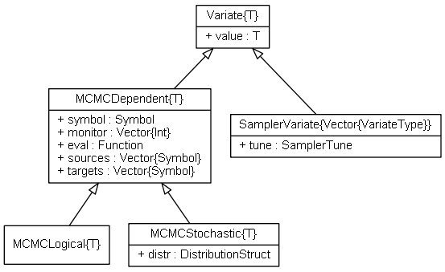

Variate Types
=============

.. index:: Variate Types
.. index:: Variate Types; AbstractVariate
.. index:: Variate Types; ScalarVariate
.. index:: Variate Types; ArrayVariate
.. index:: Variate Types; VectorVariate
.. index:: Variate Types; MatrixVariate

.. _section-Variate:

Variate
-------

``Variate`` is a set of abstract types that serves as the basis for several concrete types in the *Mamba* package.  Conceptually, it represents a data structure that stores numeric values sampled from a target distribution.  As an abstract type, ``Variate`` cannot be instantiated and cannot have fields.  It can, however, have method functions, which descendant subtypes will inherit.  Such inheritance allows one to endow a core set of functionality to all subtypes by simply defining the functionality once on the abstract type (see `julia Types <http://docs.julialang.org/en/latest/manual/types/>`_).  Accordingly, a core set of functionality is defined for the ``Variate`` type through the field and method functions summarized below.  Although the (abstract) type does not have fields, its method functions assume that all subtypes will be declared with the ``value`` field shown.

Declarations
^^^^^^^^^^^^^
.. code-block:: julia

    abstract ScalarVariate <: Real
    abstract ArrayVariate{N} <: DenseArray{Float64, N}

    typealias AbstractVariate Union{ScalarVariate, ArrayVariate}
    typealias VectorVariate ArrayVariate{1}
    typealias MatrixVariate ArrayVariate{2}

    abstract SamplerTune
    type SamplerVariate{T<:SamplerTune} <: VectorVariate

Type Hierarchy
^^^^^^^^^^^^^^

Subtypes of ``Variate`` include the :ref:`section-Dependent`, :ref:`section-Logical`, and :ref:`section-Stochastic` types, as well as the those defined for supplied :ref:`section-Sampling-Functions`.

    UML relational diagram of ``Variate`` types and their fields.

Field
^^^^^

* ``value::T`` : a scalar or array of ``Float64`` values that represent samples from a target distribution.

Methods
^^^^^^^
Methods for ``ScalarVariate`` and ``ArrayVariate`` include `mathematical operators <http://julia.readthedocs.org/en/latest/stdlib/math/#mathematical-operators>`_, `mathematical functions <http://julia.readthedocs.org/en/latest/stdlib/math/#mathematical-functions>`_, and `statistics <http://julia.readthedocs.org/en/latest/stdlib/math/#statistics>`_ defined in the base **julia** language for parent types ``Real`` and ``DenseArray``.  In addition, the following functions are provided.

=============== ================
Function        Description
=============== ================
``logit(x)``    log-odds
``invlogit(x)`` inverse log-odds
=============== ================
